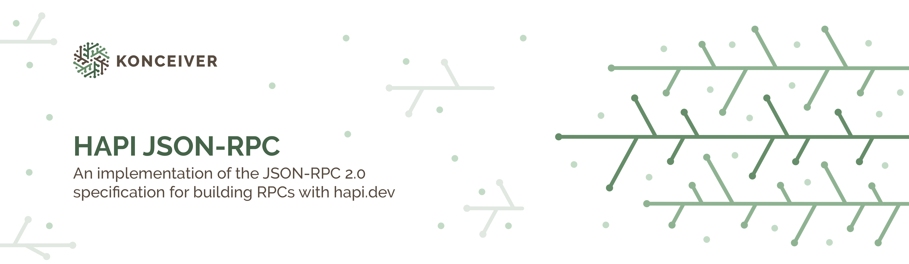

# @konceiver/hapi-json-rpc

<p align="center"></p>

[](https://npmjs.com/package/@konceiver/hapi-json-rpc)
[](https://npmjs.com/package/@konceiver/hapi-json-rpc)
[](https://github.com/konceiver/hapi-json-rpc/actions?query=workflow%3Arun-tests+branch%3Amaster)
[](https://codeclimate.com/github/konceiver/hapi-json-rpc)
[](https://codeclimate.com/github/konceiver/hapi-json-rpc)
[](https://npmjs.com/package/@konceiver/hapi-json-rpc)

This package was created by, and is maintained by [Brian Faust](https://github.com/faustbrian), and is a package provides an implementation of the JSON-RPC 2.0 specification for building RPCs with hapi.

## Installation

```bash
yarn add @konceiver/hapi-json-rpc
```

## Usage

### Joi (Default)

```ts
import * as plugin from "@konceiver/hapi-json-rpc";
import Joi from "@hapi/joi";

await server.register({
	plugin,
	options: {
		methods: [...],
		processor: {
			schema: Joi.object().keys({
				id: Joi.alternatives().try(Joi.number(), Joi.string()).required(),
				jsonrpc: Joi.string().allow("2.0").required(),
				method: Joi.string().required(),
				params: Joi.object(),
			}),
			validate(data: object, schema: object) {
				return Joi.validate(data, schema);
			},
		},
	},
});
```

### AJV

```ts
import * as plugin from "@konceiver/hapi-json-rpc";
import Ajv from "ajv";

await server.register({
	plugin,
	options: {
		methods: [...],
		processor: {
			schema: {
				properties: {
					id: {
						type: ["number", "string"],
					},
					jsonrpc: {
						pattern: "2.0",
						type: "string",
					},
					method: {
						type: "string",
					},
					params: {
						type: "object",
					},
				},
				required: ["jsonrpc", "method", "id"],
				type: "object",
			},
			validate(data: object, schema: object) {
				try {
					const ajv = new Ajv({
						$data: true,
						extendRefs: true,
						removeAdditional: true,
					});

					ajv.validate(schema, data);

					return { value: data, error: ajv.errors !== null ? ajv.errorsText() : null };
				} catch (error) {
					return { value: null, error: error.stack };
				}
			},
	},
});
```

## Testing

```bash
yarn test
```

## Changelog

Please see [CHANGELOG](CHANGELOG.md) for more information on what has changed recently.

## Contributing

Please see [CONTRIBUTING](CONTRIBUTING.md) for details.

## Security

If you discover a security vulnerability within this package, please send an e-mail to security@konceiver.dev. All security vulnerabilities will be promptly addressed.

## Credits

This project exists thanks to all the people who [contribute](../../contributors).

## Support Us

We invest a lot of resources into creating and maintaining our packages. You can support us and the development through [GitHub Sponsors](https://github.com/sponsors/faustbrian).

## License

hapi JSON-RPC is an open-sourced software licensed under the [MIT](LICENSE.md).
